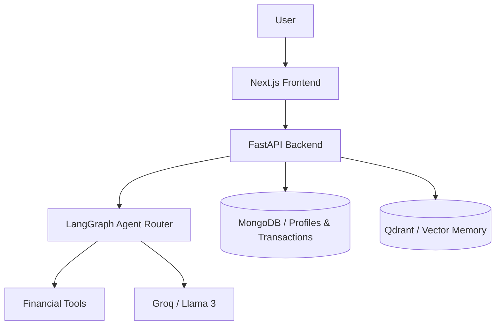

# Financial Agentic AI

Managing money is stressful enough without fighting a spreadsheet. This project automates your financial tracking, acts as a personal financial advisor, and syncs budgets across your family so everyone stays on the same page. The system does the heavy lifting to help you reach financial freedom.

## Tech Stack

<p align="left">
  
</p>

The backend relies on LangGraph to route agent decisions, Groq for fast LLM inference, and Qdrant to search your past financial data using vector memory.

## Preview

<!-- Insert Demo Video or Screenshot here -->


## System Architecture



## Features

- Track your daily expenses in seconds so you always know where your money goes.
- Ask the LangGraph agent for tax strategies or spending reviews. It reads your financial history and gives specific advice based on your real data.
- Manage shared group budgets and split expenses with family members so everyone sees the same numbers.
- Let the system audit your active subscriptions, calculate your emergency fund requirements, and warn you when lifestyle creep eats into your income.
- Set a target amount for a long-term goal, like a house down payment, and track the exact monthly contribution you need to reach it.
- Search your past transactions using natural language. The Qdrant vector database understands what you mean even if you forget the exact vendor name.

## How to Use

### 1. Start the Backend

Move to the backend directory, set up your virtual environment, and install the required packages:

```bash
cd backend
python -m venv venv
source venv/bin/activate  # On Windows: venv\Scripts\activate
pip install -r requirements.txt
```

Create a `backend/.env` file with your API keys:

```env
MONGODB_URI=mongodb://localhost:27017
GROQ_API_KEY=your_groq_key
GEMINI_API_KEY=your_gemini_key
FRONTEND_URL=http://localhost:3000
```

Start the API server:

```bash
uvicorn main:app --reload
```

### 2. Start the Frontend

In the root directory, install the Node dependencies:

```bash
npm install
```

Create a `.env.local` file to point to the backend:

```env
BACKEND_URL=http://127.0.0.1:8000
```

Start the Next.js development server:

```bash
npm run dev
```

Open `http://localhost:3000` to access the interface.

## License

This project is licensed under the MIT License. See the [LICENSE](LICENSE) file for details.
