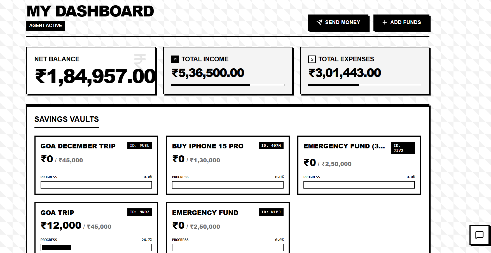
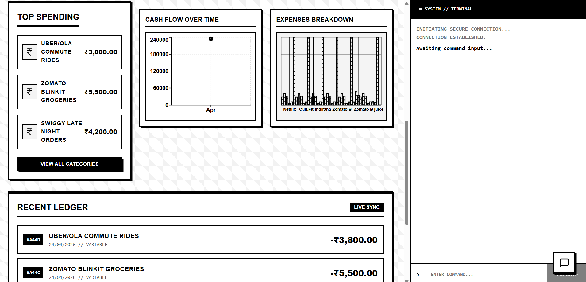

# Financial Agentic AI

<div align="left">
  
</div>

## Description

A strictly deterministic, mathematically-sound autonomous financial assistant built across a decoupled microservice architecture. The ecosystem bridges a neo-brutalist Next.js dashboard with a fault-tolerant Python FastAPI backend natively powered by **LangGraph** and **ChatGroq**. The agent executes atomic operations securely against an Async MongoDB (Motor) state machine and a responsive Qdrant local Vector database ensuring robust AI semantic retrievals paired linearly against literal transaction ledgers without hallucinations over real-time **Server-Sent Events (SSE)**.

## Screenshots




## Architecture

The project represents a strict environment proxy utilizing server-side boundaries to drop native computation logic downstream:
* **Frontend (Next.js App Router):** Operates entirely as a headless presentation layer utilizing raw Fetch streams natively mapping responses down to the exact DOM components bypassing standard REST caching dynamically.
* **Backend (FastAPI & Uvicorn):** Powers asynchronous task resolution running entirely disconnected from the frontend explicitly validating environments cross-platform natively executing LangChain tool cascades on concurrent memory maps.
* **Orchestration (LangGraph & Groq):** Employs explicit System-level instructions mapping strict Pydantic execution models over a multi-key AI configuration array capturing `HTTP 429` rate bumps continuously feeding inference via `.with_fallbacks()` logic safely into `llama-3.3-70b-versatile`.
* **Data Integration (MongoDB & Qdrant):** Combines NoSQL ledger mathematics updating `userprofiles` and `transactions` perfectly tracking native arrays against qualitative HuggingFace semantic encodings via `all-MiniLM-L6-v2`.

## All Features

* **Multi-Key Fault Tolerant Intelligence:** Bypasses dynamic free-tier limits automatically dropping traffic across nested API-keys seamlessly resuming failed Langchain tool calls iteratively.
* **Real-Time Terminal Pipeline (SSE):** Features explicit streaming capabilities reading binary chunks strictly processing text over standard TextDecoder React components mimicking true SSH terminals.
* **Live Neo-Brutalist Dashboard Synching:** Directly injects dynamic React parameters re-spinning mathematical balances, Income graphs, and Savings components recursively natively the second the LLM finalizes background MongoDB modifications.
* **RAG Semantic Embeddings:** Evaluates user histories conceptually identifying relationships (e.g. "How much do I spend casually?") by checking qualitative properties outside normal numerical parameters locally on Qdrant.
* **Deterministic Transaction Fusing:** Operates under strict Python boundaries preventing the LLM from inventing transactions or "calculating sums" by manually locking its intelligence behind actual executable math functions accurately hitting `.find_one_and_update()`.
* **Client Auto-Scrolling & Resets:** Integrates continuous smooth `useRef` React hooks alongside hardcoded terminal execution handlers gracefully intercepting edge functions like `clear`.

## Tech Stack

* **Next.js & React 18**
* **TypeScript**
* **TailwindCSS & Recharts**
* **Python 3 / FastAPI / Uvicorn**
* **LangChain / LangGraph**
* **Groq API / Llama 3.3 (70B)**
* **MongoDB (Motor Asyncio)**
* **Qdrant Vector Database**
* **Sentence-Transformers (Hugging Face)**

## Local Setup Instructions

1. **Clone the Repository**
   ```bash
   git clone <repository-url>
   cd Financial-Agentic-AI
   ```

2. **Frontend Initialization (Next.js)**
   ```bash
   npm install
   # or
   pnpm install
   ```

3. **Backend Virtual Environment (FastAPI/Python)**
   ```bash
   # Assuming you are at the root
   python -m venv venv
   
   # Activate Environment 
   # Windows: .\venv\Scripts\activate
   # Mac/Linux: source venv/bin/activate
   
   pip install -r backend/requirements.txt
   ```

4. **Environment Variables Configuration**
   - Head to the `backend/` directory and explicitly create a `.env` file targeting your remote instances:
   ```env
   # Storage Backends
   MONGODB_URI="mongodb+srv://<your-cluster-string>..."
   MONGO_DB_NAME="financial_agent_db"
   
   # Multi-Key Fault Tolerant Fallbacks
   GROQ_API_KEY_1="gsk_real_key_here..."
   GROQ_API_KEY_2="gsk_secondary_key..." # Optional bypass
   GROQ_API_KEY_3="gsk_third_key..."    # Optional bypass
   
   # CORS Permissions
   FRONTEND_URL="http://localhost:3000"
   ```

5. **Deploy Core Runtimes**
   ```bash
   # Terminal 1: Spin up Next.js Edge Router
   npm run dev
   
   # Terminal 2: Initialize Uvicorn Vector Backend
   # From the root directory:
   python -m uvicorn backend.main:app --reload
   ```

Navigate immediately to `http://localhost:3000` upon boot completion to interact with the LLM.
